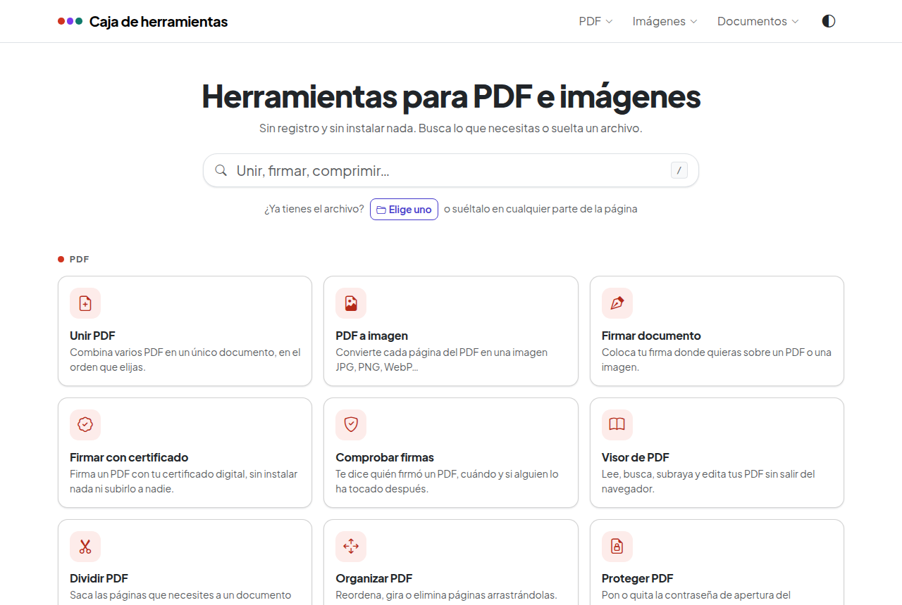
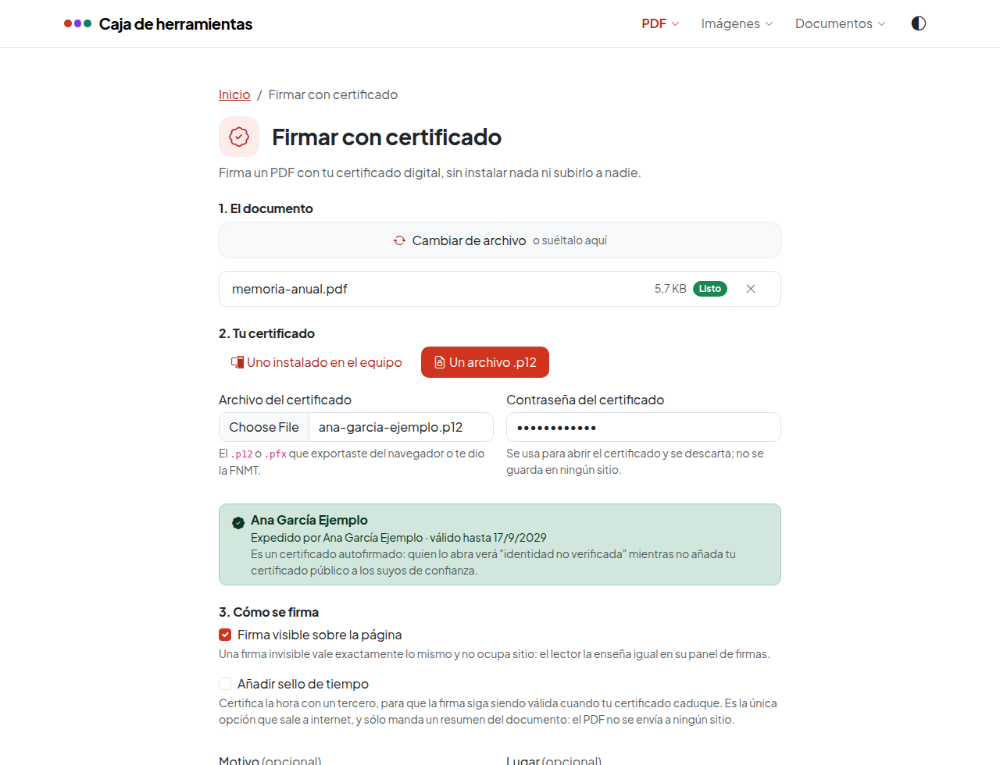
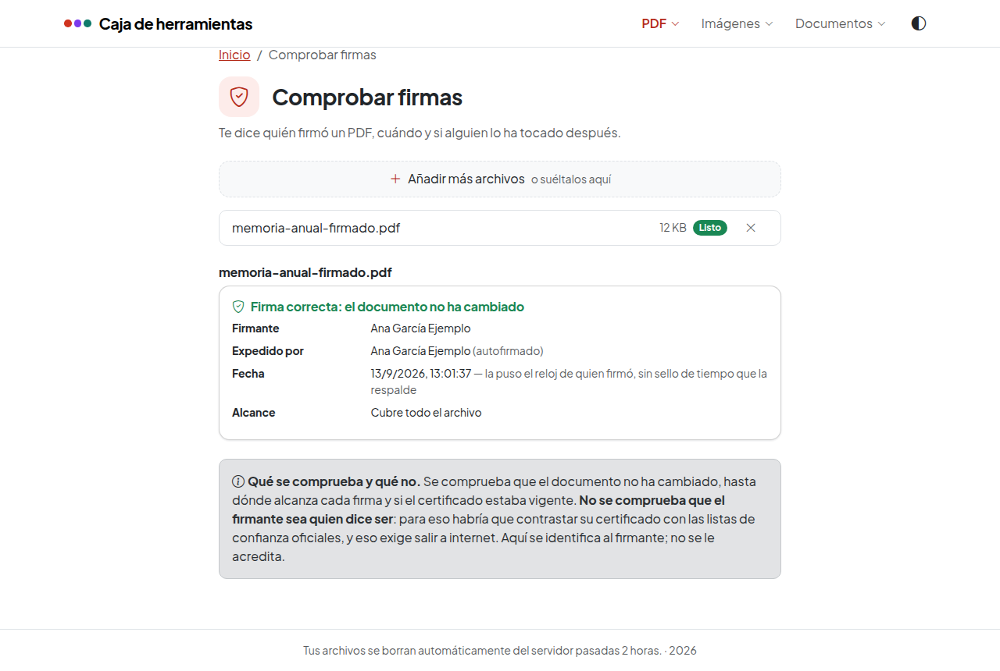
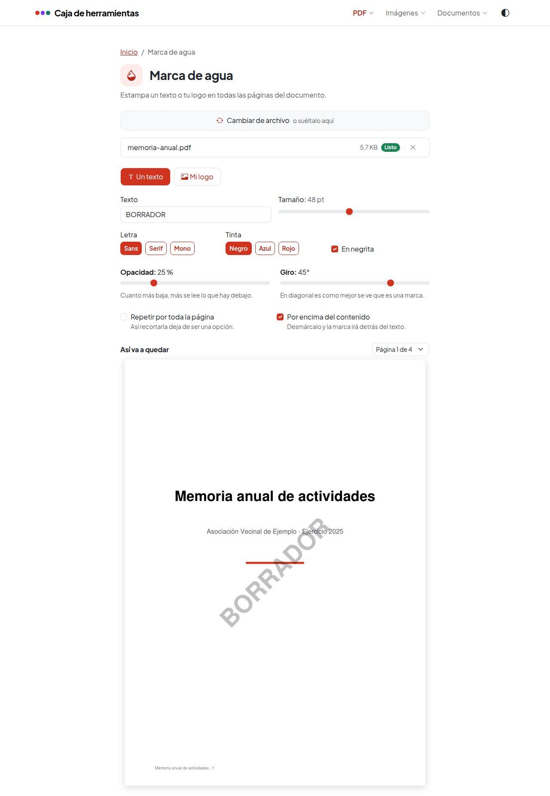
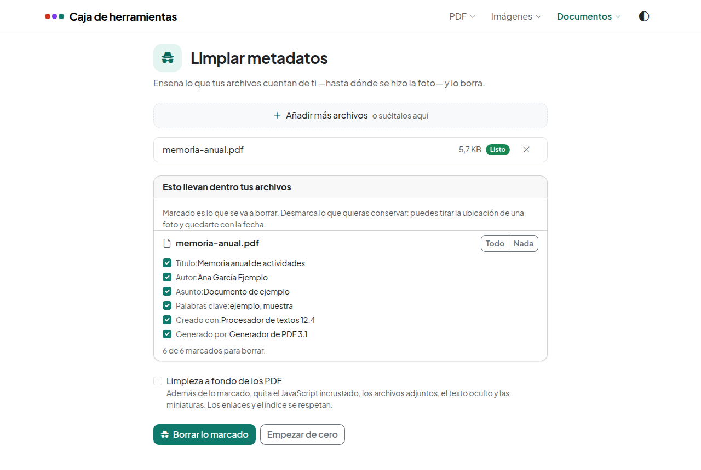
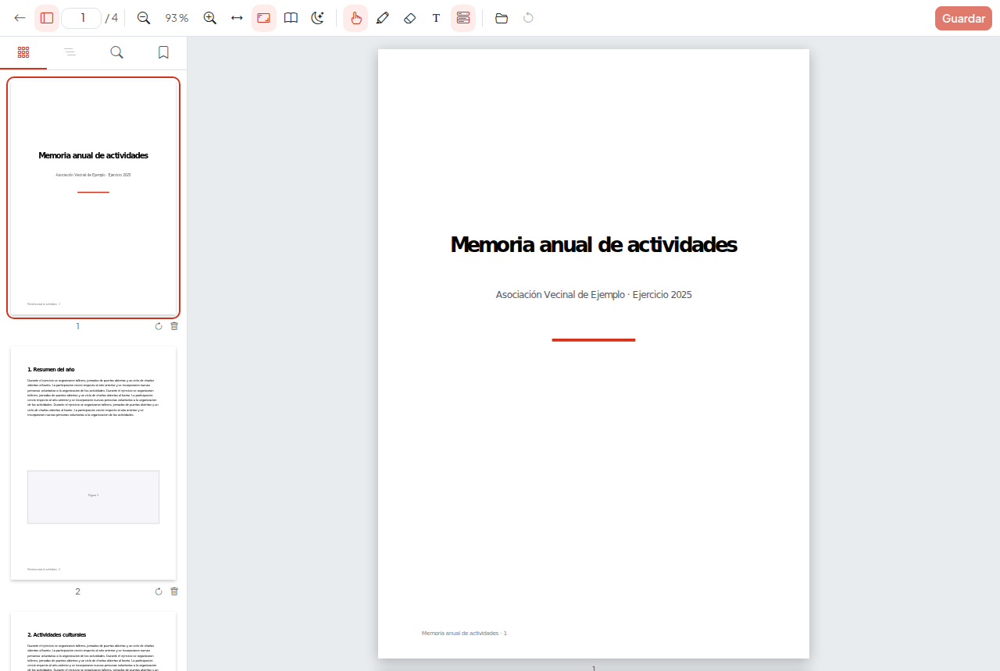

# Caja de herramientas para PDF e imágenes

Aplicación web con varias utilidades para trabajar con documentos e imágenes.
El procesado ocurre en el servidor; el navegador sólo sube, ordena y descarga.

- **Frontend**: Angular 22 (componentes independientes) + Bootstrap 5.
- **Backend**: Flask con un blueprint por herramienta (PyMuPDF, Pillow, pypdf,
  markitdown, LibreOffice y segno hacen el trabajo).
- **Despliegue**: Docker Compose con **tres servicios** de backend —uno para
  subidas y descargas, uno para lo barato y uno para el trabajo pesado— y nginx
  sirviendo el frontend y repartiendo la API entre ellos.



Pensada para usarse, no sólo para funcionar:

- **Encadenar herramientas.** Cada resultado tiene «Seguir con otra
  herramienta»: comprimes, y el PDF pasa a Firmar o a Organizar sin descargarlo
  y volverlo a subir. Sólo se ofrecen las herramientas que admiten ese archivo.
- **Buscar y soltar.** En la portada escribes «juntar» y aparece Unir PDF (tecla
  `/` para buscar, Intro para entrar). O sueltas un archivo en cualquier parte y
  te dice qué puedes hacer con él.
- **Te explica lo que pasa.** Si sueltas un archivo que no vale, lo dice y te
  propone la herramienta que sí lo admite. Si el botón está apagado, pone por
  qué. Si comprimir no gana nada, dice que ya estaba optimizado en vez de
  celebrarlo.
- **Un color por familia y modo oscuro.** PDF en rojo, Imágenes en violeta y
  Documentos en verde azulado, en claro u oscuro (automático, o a mano desde el
  menú). Todos los colores cumplen el contraste AA de WCAG.
- **Accesible.** Sin fallos serios ni críticos de axe-core en claro, oscuro,
  escritorio y móvil, navegable con teclado y con áreas táctiles de 44 px.

## Herramientas

| Herramienta | Qué hace | Opciones |
|---|---|---|
| Visor de PDF | Lee, busca, subraya, rellena formularios y edita sin salir del navegador | pantalla completa, en `/visor` |
| Unir PDF | Combina varios PDF en uno | orden por arrastre |
| PDF a imagen | Una imagen por página | formato de salida, 96/150/300 ppp y calidad |
| Dividir PDF | Saca páginas sueltas o rangos | `1-3, 7, 10-`, un archivo o uno por página |
| Organizar PDF | Reordena, gira y elimina páginas | arrastre, giro de 90° y borrado |
| Proteger PDF | Pone o quita la contraseña de apertura | cifrado AES-256 |
| Aplanar PDF | Fija los formularios y las anotaciones dentro de la página | campos, anotaciones, varios documentos de una vez |
| PDF con OCR | Reconoce el texto de un escaneado | español, inglés o ambos |
| Firmar documento | Coloca tu firma sobre un PDF o una imagen | posición libre, tamaño, giro, página |
| Firmar con certificado | Firma un PDF con tu certificado digital | con el certificado del equipo (AutoFirma) o un `.p12`, visible o invisible, sello de tiempo |
| Comprobar firmas | Dice quién firmó un PDF y si lo han tocado después | ninguna: se comprueba al subirlo |
| Comprimir PDF | Recomprime las imágenes del documento y lo optimiza para la web | ninguna, suave, media, fuerte; optimizar para verlo en la web |
| Comprimir imagen | Baja el peso de varias imágenes a la vez | calidad y tamaño máximo |
| Convertir imagen | Cambia de formato | JPG, PNG, WebP, TIFF, BMP, PDF |
| Imagen a PDF | Reúne varias imágenes en un PDF | tamaño de página, orientación, margen y calidad |
| Documento a Markdown | Extrae el contenido para dárselo a un LLM | unir todo en un archivo |
| Documento a PDF | Pasa Word, ODT, RTF o texto plano a PDF | varios documentos de una vez |
| PDF a Word | Saca un `.docx` editable de un PDF | varios documentos de una vez |
| Markdown a PDF | Maqueta un `.md` como documento | tamaño, orientación, tipo de letra, color de acento, cuerpo, margen y respetar los saltos de línea |
| Limpiar metadatos | Enseña lo que tus archivos cuentan de ti y borra lo que elijas | campo a campo, limpieza a fondo |
| Marca de agua | Estampa un texto o tu logo en todas las páginas | texto o imagen, mosaico, opacidad y giro, con vista previa |
| Numerar páginas | Numera el documento | posición, formato, desde qué página, con vista previa |
| Extraer imágenes | Saca las imágenes que lleva dentro un PDF | tamaño mínimo y formato |
| Generar QR | Códigos QR de un enlace, tu wifi o tu contacto | PNG o SVG |
| Crear certificado | Genera un certificado propio para firmar | validez, tamaño de clave, contraseña |

Cualquier resultado se puede ver antes de descargarlo, con el ojo que hay junto
a su nombre: se abre encima de la página y se cierra con `Esc`. Los PDF los
enseña el visor del propio navegador, así que no cuesta ni un kilobyte de
descarga; las imágenes se ven tal cual y el texto —Markdown, CSV, JSON— se lee
en pantalla. Donde no hay nada que enseñar no aparece el ojo: un `.docx` no lo
sabe abrir ningún navegador.

También se puede renombrar antes de descargarlo, con el lápiz que hay al lado.
Como la lista de resultados es la misma para todas, ambas opciones están en
todas las herramientas. La extensión la conserva el servidor, así que un PDF
sigue siendo un PDF por mucho que se le cambie el nombre.

Las herramientas de imagen aceptan varios archivos y ofrecen descargar todo en un
ZIP, cuyo nombre también se puede cambiar. "Comprimir PDF" nunca devuelve un archivo más pesado que el original: si la
compresión no mejora nada (porque el PDF ya venía optimizado), entrega el
original. Esa red de seguridad se levanta al pedir "optimizar para verlo en la
web": linearizar reordena el archivo para que un visor enseñe la primera página
sin haberlo descargado entero, y eso cuesta unos kilobytes; devolver el original
sería deshacer justo lo que se ha pedido.

Los formatos de destino no están escritos a mano: se le preguntan a Pillow en el
arranque, así que la interfaz nunca ofrece uno que después falle al guardar.
"PDF a imagen" ofrece la misma lista sin PDF, y admite cualquier formato de
salida disponible; "Imagen a PDF" acepta como entrada todo lo que Pillow sepa
abrir en esta instalación.

### Algunas pantallas

**Firmar con certificado.** Dos formas de firmar, según dónde esté tu clave: con
un certificado instalado en el equipo, a través de AutoFirma, o con un archivo
`.p12`. En cuanto se abre el certificado, la pantalla dice de quién es y hasta
cuándo vale.



**Comprobar firmas.** Quién firmó, cuándo, si el documento sigue intacto y hasta
dónde alcanza cada firma. Con la advertencia, bien visible, de lo que esto **no**
comprueba.



**Marca de agua.** La vista previa la dibuja el servidor con el mismo código que
va a escribir el archivo, así que lo que se ve es lo que sale.



**Limpiar metadatos.** Primero enseña lo que tus archivos cuentan de ti, campo a
campo, y tú eliges qué se borra.



**El visor**, que ocupa la pantalla entera y está pensado para sesiones largas.



### Firmar con certificado

"Firmar documento" estampa el **dibujo** de una firma. Se parece a una firma y no
prueba nada: se recorta y se pega en otro documento, y nada delata si el texto ha
cambiado. "Firmar con certificado" es otra cosa: la firma va **dentro** del PDF,
atada a sus bytes, y demuestra quién firmó y que nadie lo ha tocado desde
entonces. Es lo que enseña Adobe Reader con su banda azul y lo que pide una
administración.

Hasta ahora, para firmar con el certificado de la FNMT había dos caminos:
instalar AutoFirma, o subir el documento a una web ajena. Y para lo contrario
—comprobar si el PDF que te llega está firmado de verdad y por quién— sólo
quedaba el segundo, con el agravante de que ese suele ser justo el documento que
menos ganas hay de enseñar.

### Por qué no sale el selector de certificados del navegador

Hay dos formas de firmar, y la diferencia entre ellas es dónde está la clave.

La pregunta natural es por qué la herramienta pide un archivo `.p12` en vez de
abrir el almacén de certificados, como cualquier sede electrónica. **Porque
ninguna página web puede hacerlo**: no existe API, y es deliberado —si la
hubiera, cualquier web podría pedir que firmaras con tu certificado—. Los applets
de Java y ActiveX están eliminados, `<keygen>` se retiró del estándar, y
WebCrypto sólo maneja claves que la propia página genera o importa. Con el DNIe
ni siquiera cabría el arreglo: su clave no es exportable por diseño.

Lo que hacen las sedes es lanzar **AutoFirma**, un programa instalado en el
equipo. La página carga `autoscript.js`, que habla con él por un WebSocket local
o el protocolo `afirma://`; AutoFirma abre el almacén del sistema, enseña el
selector, firma **en la máquina del usuario** y devuelve el PDF. El navegador es
sólo la lanzadera. Aquí se hace lo mismo, y es la vía recomendada: **ni la clave
ni el documento salen del equipo**, no se teclea ninguna contraseña en un
formulario web, y es la única forma de firmar con el DNIe o una tarjeta.

El sello sigue siendo el nuestro: se compone aquí como imagen y se le pasa a
AutoFirma como rúbrica, así que la vista previa vale para las dos vías. La
colocación también la calcula el servidor, con las mismas funciones, para no
tener la corrección del giro de página implementada dos veces.

Requiere AutoFirma instalado, claro. Por eso la vía del `.p12` sigue estando: sin
él, o desde el móvil, es la que funciona.

### El archivo `.p12`: la clave sí pasa por el servidor

**La clave privada no toca el disco.** El `.p12` no se sube por `/api/files`,
que lo dejaría escrito en la carpeta de la sesión durante dos horas: se lee en el
navegador y viaja en base64 dentro del cuerpo de cada petición. Así no queda
estado ninguno en el servidor. Lo que sí conviene saber: la aplicación se sirve
en HTTP plano, y si no hay HTTPS delante, la pantalla lo avisa antes de que
metas nada.

El recuadro de la firma se coloca arrastrándolo, como en "Firmar documento", y lo
que se arrastra es **el sello de verdad**: lo dibuja pyHanko con la misma clase
que compone la apariencia de una firma, así que no hay una versión para enseñar y
otra para escribir. Puede llevar además tu firma a mano, a la izquierda del texto;
no añade validez —eso lo pone el certificado— pero es lo que se reconoce de un
vistazo.

El **sello de tiempo** es opcional y viene apagado (en la vía de AutoFirma lo
configura la propia aplicación, en Herramientas → Preferencias). Sin él, la fecha que aparece
la pone el reloj del servidor y no demuestra nada; peor aún, el día que caduque
tu certificado la firma deja de verificarse, porque nadie puede saber si firmaste
antes o después. Con él, una autoridad de sellado da fe de la hora y la firma
aguanta. Es la única función de toda la aplicación que sale a internet, y lo
único que manda es un resumen de 32 bytes: el documento no viaja.

"Comprobar firmas" contesta lo que se puede contestar sin conexión: si el
documento está intacto, hasta dónde alcanza cada firma —una firma puede estar
perfectamente bien y aun así no cubrir las páginas que alguien añadió después—,
quién dice haber firmado y si su certificado estaba vigente. Lo que **no**
contesta, y la pantalla lo dice, es si el firmante es quien dice ser: para eso
haría falta contrastar su certificado con las listas de confianza europeas.

Y para quien no tiene certificado, "Crear certificado" genera uno autofirmado.
Sirve para demostrar integridad y para firmar entre gente que ya se conoce, pero
Adobe lo marcará como "identidad no verificada": no vale para trámites oficiales.

### El visor

El visor (`/visor`) no es una herramienta de un disparo: está pensado para
trabajar con un documento durante horas. Lee, busca con o sin tildes, navega por
el índice del PDF, subraya en cuatro colores, elimina palabras del archivo,
escribe encima para rellenar huecos, gira y quita páginas, todo con **un solo
guardado al final**.

Desde la barra se abre otro PDF sin salir del visor, y pregunta dónde: aquí
mismo o en otra pestaña. Si aquí hay cambios sin guardar, avisa antes de
cambiar de documento —lo que llevas apuntado se queda en el navegador y vuelve
al reabrir ese archivo, pero todavía no está dentro del PDF—.

Al abrir un documento se enseña la página entera; en pantallas estrechas se
ajusta al ancho, que es lo legible ahí. Si se cambia el ajuste, se recuerda para
los documentos siguientes.

Leyendo, al terminar de seleccionar un texto aparece un menú con qué hacer con
él —subrayar en cualquiera de los cuatro colores, eliminarlo del PDF, copiarlo o
buscarlo en el documento—, sin tener que cambiar antes de herramienta. Se apaga
desde la barra si estorba, y esa preferencia se recuerda.

Cuando el PDF es un **formulario de verdad** —de esos con campos rellenables
dentro del archivo—, el visor los detecta y los enseña como lo que son: se
escribe en ellos, se marcan las casillas y se eligen las opciones, y al guardar
los valores quedan **dentro de sus campos**, así que el archivo sigue siendo un
formulario y quien lo reciba puede corregir algo si hace falta. Los campos se
rellenan leyendo; con una herramienta de marcado activa se apartan para no
tragarse el arrastre, y un interruptor de la barra los apaga del todo.

Y sabe **escribir sobre el documento**, que es lo que hace falta ante un impreso
con huecos: se pulsa donde está la raya y se escribe, eligiendo tipo de letra,
cuerpo, negrita, cursiva y tinta. Las cajas se arrastran para colocarlas, se
vuelven a pulsar para corregirlas y `Supr` las quita; una que se quede vacía no
deja rastro.

Esas opciones están en la barra y, además, en un **menú flotante junto a la
propia caja**, para no tener que subir a la barra en cada campo. Son botones y no
desplegables a propósito: un desplegable se lleva el foco y daría por cerrada la
caja a media palabra, mientras que un botón puede cancelar el cambio de foco y
dejar el cursor donde estaba.

El texto se escribe en el contenido de la página, no como anotación: se ve igual
en cualquier lector, se imprime siempre y nadie lo puede mover después. Se usan
las tres familias clásicas del PDF —Helvetica, Times y Courier, con sus negritas
y cursivas—, que PyMuPDF lleva dentro y de las que el navegador tiene
equivalentes con **las mismas métricas** (Arial, Times New Roman, Courier New):
por eso lo que se ve escrito en pantalla mide y cae exactamente donde acaba en
el archivo, sin instalar ni servir un solo tipo de letra.

Lo que se guarda de cada texto es el **inicio de su línea base**, no la esquina
de su caja: es la única referencia que el navegador y PyMuPDF sitúan igual, ya
que el alto de una caja de texto depende de métricas que no coinciden entre
Arial y Helvetica. Medido sobre el archivo guardado, lo escrito cae a menos de
0,3 pt de donde se pulsó, y sigue siendo así con la página girada en el visor o
con un PDF que ya venga con `/Rotate`.

Lo que lo hace ir fino con documentos densos, medido sobre un PDF de 200 páginas
con imágenes:

- **Virtualización propia** (`pages/visor/disposicion.ts`): se calculan las
  posiciones de todas las páginas sin dibujarlas y sólo se monta lo que se ve.
  De 200 páginas hay 2 en el DOM.
- **Nada se cachea como imagen**: lo dibujado vive en el lienzo que está en
  pantalla y muere con él. Recorrer el documento entero mueve la memoria de
  9,5 a 13 MB, y los nodos del DOM se quedan donde estaban. Es la diferencia
  entre aguantar tres horas o no.
- **Una página cada vez y por prioridad**, cancelando lo que sale de pantalla
  (`core/visor-render.service.ts`): el worker de pdf.js es de un solo hilo.
- Primera página a la vista en **0,4 s**; buscar en las 200 páginas, 0,2 s.

Dos cosas que este uso destapó y que están resueltas:

- **La sesión del servidor caduca a las 2 horas** y el visor no lo toca mientras
  se lee. Hay un `keepalive` cada 15 minutos con la pestaña visible y, si aun
  así el archivo ya no está al guardar, **se resube solo y reintenta**.
- **Posición, zoom y marcas sin guardar se recuerdan** entre visitas, guardados
  en el navegador contra una huella del archivo. Un refresco accidental ya no
  cuesta una hora de trabajo. La huella no usa `crypto.subtle`: no existe fuera
  de contexto seguro, y esto se sirve por HTTP en la red local.

Al eliminar palabras se usa `apply_redactions` de PyMuPDF, que **borra el texto
del archivo**: no queda debajo del rectángulo, no se puede copiar ni buscar. Los
subrayados, en cambio, son anotaciones estándar: se ven en Acrobat, se pueden
quitar una a una y el texto de debajo sigue intacto.

"PDF con OCR" cierra el círculo de "Documento a Markdown": un escaneado no
tiene texto que extraer, así que primero se le pasa el reconocimiento y después
ya se puede convertir, buscar y copiar. Lo hace
[ocrmypdf](https://github.com/ocrmypdf/OCRmyPDF), que necesita **Tesseract y
Ghostscript instalados en la imagen** —de ahí el `apt-get` del Dockerfile— y es,
con diferencia, la operación más lenta y más golosa de memoria de la
aplicación: de ahí el límite de páginas y que se ejecute como proceso aparte,
con su propio tiempo máximo.

Es también la razón de que la imagen use **Python 3.12** (ocrmypdf exige 3.11 o
superior) y de que Pillow suba a la rama 12: las versiones nuevas de
`pdfminer.six` que arrastra ocrmypdf traen consigo un `pdfplumber` que ya no
admite Pillow 10.

"Documento a Markdown" acepta PDF, Word, Excel, PowerPoint, HTML, CSV y EPub.
Los PDF los lee con PyMuPDF (`backend/api/pdf_estructura.py`) y el resto con
[markitdown](https://github.com/microsoft/markitdown) de Microsoft. Conserva
la estructura —títulos, listas y tablas— en vez de escupir texto plano, enseña
el resultado en pantalla con el recuento de palabras y una estimación de tokens,
y lo copia al portapapeles de un clic. Un PDF escaneado no da texto y la
herramienta lo dice claramente: no hace OCR.

Los PDF no pasan por markitdown porque lo lee con pdfminer como un chorro de
texto: los títulos salen como una línea más, la negrita que muchos programas
simulan escribiendo el texto dos veces con medio punto de desplazamiento salía
**duplicada** («PPeerrssoonnaa»), el pie de cada página («1 de 2») acababa en mitad
del texto, las tablas sin rejilla se perdían y, como todo salía sin líneas en
blanco, el Markdown entero se leía como un único párrafo. PyMuPDF da cada trozo
de texto con su tamaño, su fuente y su posición, y con eso se reconstruyen los
títulos (por tamaño, o por ir enteros en negrita y solos en su renglón), la
negrita y la cursiva, las listas con su sangría, los bloques de código, las
citas y las tablas: las de rejilla con `find_tables()` y las que no la tienen
—la mayoría— alineando columnas. Las celdas de formulario, con una etiqueta
pequeña encima del valor, se desdoblan en una fila de etiquetas y otra de
valores; una tabla que sigue en la página siguiente se une con su cabecera
repetida quitada, y lo que se repite en la cabecera o el pie de todas las
páginas sale del texto (si no lleva número de página, queda una vez al final;
en un documento de una sola página se quita lo que en el pie repite un texto de
la propia página, como el título). Una cabecera sólo se quita si es letra
pequeña: un título grande arriba del todo es contenido. Las casillas dibujadas
delante de un texto salen como `[x]` o `[ ]` —se mira el centro en píxeles para
saber si están marcadas—, así que una lista de tareas o las opciones de un
impreso sobreviven a la ida y vuelta.
Una portada se marca con el salto de página de siempre,
`<div style="page-break-after: always"></div>`, y un texto centrado o a la
derecha, con `<p align="…">`: "Markdown a PDF" entiende las dos cosas.

Esa dependencia es la que más pesa del backend: markitdown arrastra `magika`
(detección de tipos), que a su vez trae `onnxruntime` y `numpy`, y los extras de
Office traen `pandas`. Son unos 350 MB más de imagen y un `docker compose build`
notablemente más lento. `.zip` se queda fuera de los formatos admitidos a
propósito, aunque markitdown lo soporte: descomprimir en el servidor lo que suba
cualquiera invita a una zip bomb.

"Documento a PDF" y "PDF a Word" cierran el otro círculo, el de la ofimática.

De Word a PDF convierte **LibreOffice Writer sin interfaz**, que es lo único que
respeta estilos, tablas, imágenes y saltos de página de un `.docx`; pandoc, la
alternativa ligera, reescribe el documento y la maquetación se queda por el
camino. Acepta también `.doc`, `.odt`, `.rtf` y texto plano, y todo el lote se
convierte en **una sola llamada**: arrancar LibreOffice cuesta unos segundos y
cada documento, décimas.

De PDF a Word lo hace [pdf2docx](https://github.com/ArtifexSoftware/pdf2docx),
que reconstruye párrafos, tablas e imágenes leyendo el archivo con PyMuPDF. Sale
un `.docx` editable, pero **aproximado**: un PDF no guarda párrafos, sino
posiciones de letras sobre la página, así que hay que repasarlo. Y un escaneado
no tiene texto que sacar; para eso está "PDF con OCR" antes.

Las dos son caras y se lanzan **como proceso aparte**, igual que el OCR: así se
pueden cortar por tiempo, su memoria vuelve entera al terminar y ni opencv ni
numpy se quedan residentes en el servidor entre conversión y conversión. Y las
tres —éstas dos y el OCR— comparten **turno** (`backend/api/conversion.py`):
sólo un trabajo de estos a la vez en todo el proceso, porque el servidor atiende
con cuatro hilos y cuatro LibreOffice —o cuatro OCR— arrancando a la vez se
llevan por delante el contenedor. El turno es uno para los tres y no uno por
herramienta porque lo que se está repartiendo es la memoria, y a ésta le da
igual quién se la coma. A quien llega y lo encuentra ocupado se le dice que
vuelva en un momento, en lugar de dejarle esperando hasta que nginx corte.

"Markdown a PDF" cierra el círculo de "Documento a Markdown" por el otro lado:
de un PDF sale el texto para dárselo a un LLM, y lo que el LLM devuelve —que casi
siempre es Markdown— vuelve a ser un documento presentable sin pasar por un
editor. La vara de medir es esa: que el PDF que sale **se reconozca como el
documento del que salió el Markdown** y tenga aspecto de documento cuidado. Se
maquetan títulos, listas (también las de tareas, con su casilla), tablas,
bloques de código coloreados si dicen su lenguaje, citas y enlaces; se elige
tamaño de página, orientación, tipo de letra, color de acento, cuerpo y margen.

Lo maqueta **WeasyPrint**, que convierte HTML y CSS de impresión en PDF sin
navegador. La primera versión usaba `fitz.Story` de PyMuPDF, y MuPDF entiende un
subconjunto de CSS que se quedaba corto justo en lo que hace que un documento lo
parezca: las tablas no se podían estirar al ancho de la página, el código en
línea no podía llevar fondo, no había `nth-child` ni numeración de páginas. Con
WeasyPrint sale: título con filete de color, apartados en banda tenue con su
barra, tablas a todo el ancho con la cabecera repetida al saltar de página,
filas que no se parten, pie con el título y «Página n de N» y, si el documento
abre con un título y un salto de página, una portada.

Las tablas **se leen antes de pintarlas**: una fila entera en negrita es una
fila de etiquetas, como en un impreso, y la tabla se dibuja con rejilla; la
última fila en negrita es la de totales; una tabla de dos columnas cortas con
importes es un cuadro de totales, que va a la derecha como en una factura, y las
columnas numéricas se alinean a la derecha aunque el Markdown no lo pida.

Las letras son Inter, Charis SIL y DejaVu Sans Mono, instaladas desde Debian.
WeasyPrint incrusta sólo los caracteres usados: una página pesa unos 70 kB y
63 páginas con tablas, 234 kB. Tarda unos 75 ms por página (63 páginas, 4,6 s)
y no pasa por el turno de las conversiones pesadas: no arranca ningún proceso.

Quien lee el Markdown es **markdown-it-py**, que sigue CommonMark, y la elección
importa más de lo que parece. La primera versión usaba Python-Markdown y se
equivocaba con documentos normales: exige una línea en blanco antes de cada
tabla, cosa que casi nadie escribe, y aplana las listas anidadas con dos
espacios de sangría. Va además con el HTML activado, para que el `<br>` de
dentro de una celda sea un salto de línea de verdad: las tablas que escribe un
LLM lo usan constantemente para poner una nota bajo el nombre.

Y **respeta los saltos de línea sueltos**, que es justo lo contrario de lo que
manda el estándar. En Markdown dos líneas seguidas son el mismo párrafo, y está
bien para quien escribe prosa partida a lo ancho; pero lo que más entra aquí es
texto sacado de otro documento —el que devuelve "Documento a Markdown", sin ir
más lejos— con una línea por renglón y ninguna línea en blanco, y fundirlas deja
el documento hecho un ladrillo, con el título, el subtítulo y los apartados en la
misma frase. Se puede desmarcar en la propia pantalla, y entonces manda el
estándar.

Conviene saber que **el círculo no se cierra del todo**: de un PDF a Markdown y
de vuelta a PDF no se recupera el documento de partida. Extraer es adivinar, y
markitdown reconstruye las tablas mirando en qué columna cae cada palabra, así
que una nota escrita bajo el nombre del ejercicio —dentro de su celda— sale como
una fila aparte, y lo que en el original era un título vuelve como una línea de
texto más. Si conservas el Markdown original, ése es el que hay que maquetar; el
que sale de una extracción es una aproximación, por buena que parezca.

Un detalle que conviene saber: **nada de lo que enlace el documento se va a
buscar**. WeasyPrint recibe un `URLFetcher` que sólo admite `data:` y no hay
`base_url`, así que un `.md` con `` no lee nada del disco del
servidor y uno con una imagen en `http://` no le pide nada a nadie —comprobado
con un servidor a la escucha—. Se incrustan sólo las imágenes que el propio
archivo trae dentro.

"Limpiar metadatos" es la que mejor explica por qué existe esta aplicación. Un
PDF lleva dentro quién lo escribió y con qué programa; una foto de móvil lleva el
modelo de la cámara, la fecha exacta y, muy a menudo, **las coordenadas del sitio
donde se hizo**. Todo eso viaja cada vez que se manda un archivo.

Va en dos fases, y ahí está la gracia: al soltar los archivos se **inspeccionan
sin tocarlos** y se enseña lo que llevan dentro —las coordenadas en grados, para
que se vea que no es un dato abstracto—, con una casilla por dato. Marcado es lo
que se va a borrar, así que se puede **tirar la ubicación de una foto y quedarse
con la fecha de la toma**. Todo empieza marcado, que es lo que quiere quien entra
aquí, y hay botones de "Todo" y "Nada" por archivo.

Lo que no se enseña de una en una —exposición, resolución y demás tecnicismos—
se agrupa en un "Otros datos de la cámara (N campos)" con su propia casilla: si
no apareciera, se borraría sin que nadie lo hubiera visto.

En los JPEG los metadatos se quitan **sin recomprimir la imagen**. Si se borra
todo el EXIF se omite su segmento; si se conserva una parte, se reconstruye el
segmento con lo que queda y los datos comprimidos se copian tal cual. Medido: el
bloque de imagen del archivo limpio es **idéntico byte a byte** al del original,
así que limpiar nunca cuesta calidad. Con "limpieza a fondo" los PDF pierden
además el JavaScript incrustado, los adjuntos, el texto oculto y las miniaturas;
los enlaces y el índice se respetan a propósito. Y un archivo del que no se marca
nada se entrega tal cual, sin reescribirlo.

"Marca de agua" y "Numerar páginas" enseñan **cómo va a quedar** antes de
ejecutar, y la vista previa la dibuja el servidor: es la página de verdad con lo
que se le va a estampar, hecha con el mismo código que escribirá el archivo. Si
la imitara el navegador habría dos implementaciones que se desviarían, y estas
dos pantallas tendrían que cargar los ~105 kB de pdf.js que hoy se ahorran. Se
refresca al tocar cualquier ajuste, con 350 ms de espera para no pedir una imagen
por píxel del deslizador, y un selector permite mirar cualquier página —en la
numeración es la única forma de comprobar que "saltar la portada" hace lo que
uno cree—.

Va en JPEG y no en PNG por una razón medida: en una página con una foto a toda
plana el PNG pesa 654 kB y el JPEG 120 kB, y aquí manda el caso peor porque la
imagen se pide una y otra vez. Cuesta unos 20 ms, y **lo mismo con un PDF de dos
páginas que con uno de doscientas**: sólo se estampa la página que se enseña.
Comprobado comparando dónde cae la tinta en la vista previa y en el archivo
final: coinciden con un desvío del 0,2 %, atribuible a la compresión, también en
un PDF que venía con `/Rotate 90`.

En mosaico, la marca **se recorta a lo que quepa en su celda**, así que las
copias salen enteras en vez de cortarse por los bordes y pisarse unas a otras.
Vale para las dos: el cuerpo del texto y el ancho del logo. Y sólo recorta —si
lo pedido ya cabía, se respeta—: "BORRADOR" a 48 pt baja a 38, "CONFIDENCIAL -
NO DISTRIBUIR" a 15, una "X" se queda en 48, y un logo al 40 % del ancho pasa
al 30 %.

El cálculo tiene en cuenta el giro, porque en diagonal la caja ocupa más que el
propio ancho, y para el logo se resuelve con trigonometría en vez de midiendo el
mapa de bits: así se decide el tamaño **antes** de rasterizar y no hay que
hacerlo dos veces. En el texto se hace por página, ya que un documento puede
mezclar tamaños.

De paso quedó corregido que el porcentaje del logo es el del dibujo y no el de
su caja girada, que es lo que ya hacía "Firmar documento": antes, una marca en
diagonal salía más pequeña que el porcentaje elegido.

Las dos escriben en el contenido de la página, no como anotación: se ven en cualquier lector y se imprimen siempre. Las dos tienen
la misma trampa resuelta, la de un PDF que ya venía girado en el archivo: los
puntos se llevan al espacio sin girar con `derotation_matrix` y al ángulo se le
suma el de la página. Medido rasterizando el resultado, la marca cae centrada al
50 % del ancho y del alto tanto en un PDF normal como en uno con `/Rotate 90`, y
el número queda a 44 pt del borde en los dos. La marca de agua se gira con
`morph` alrededor **del centro del texto**: girándola alrededor del inicio de la
línea base —que es lo que sitúa `insert_text`— se va a la esquina.

"Extraer imágenes" saca los bytes tal y como están en el archivo, sin
recomprimir. Descarta las que no llegan a un tamaño mínimo porque un PDF de
texto corriente lleva docenas de fragmentos diminutos —viñetas, filetes de las
tablas— y sin ese filtro el ZIP se vuelve inservible.

"Generar QR" es la única herramienta que no necesita que subas nada. Además del
texto libre trae atajos para lo que nadie escribe a mano: la red wifi con su
sintaxis `WIFI:S:…;T:WPA;P:…;;` —que el móvil reconoce y conecta solo, y que
escapa los `;` y `:` de la contraseña—, la tarjeta de contacto, el correo y el
teléfono. Lo hace [segno](https://github.com/heuer/segno): 75 kB, sin una sola
dependencia, y escribe PNG y SVG sin pasar por Pillow.

Las herramientas que enseñan páginas —el visor, firmar, dividir y organizar—
rasterizan el PDF en el navegador con `core/pdf.service.ts`. Ese servicio arranca poniendo
un `Promise.try` que falta: pdf.js lo usa al decodificar imágenes y zone.js, que
carga Angular, sustituye el `Promise` nativo por uno propio que no lo trae. Sin
ese remiendo, abrir un PDF con imágenes deja una promesa que nunca resuelve y la
página se queda "preparando" para siempre.

`pdfjs-dist` es la única dependencia propia del frontend, y la comparten el
visor y las herramientas que enseñan páginas. Son ~105 kB comprimidos que sólo
descarga quien entra en una de ellas, porque cada pantalla se carga por
separado. A cambio, cambiar de página es
instantáneo y la vista previa se ve nítida en pantallas de mucha densidad. La
firma se puede subir como imagen o dibujar a mano; con un lápiz que informe de
presión (un Apple Pencil, por ejemplo) el trazo engorda y adelgaza solo, y la
mano apoyada no mancha.

Quien coloca la firma ve exactamente lo que va a salir: el recorte del fondo lo
hace el servidor y lo devuelve por `/api/tools/firmar/preparar`, en vez de
imitarlo en el navegador. Sobre un PDF la firma se inserta como imagen encima de
la página, así que el documento conserva su texto y sus fuentes: no se rasteriza.

"Imagen a PDF" compone el documento con PyMuPDF: cada imagen entra en su página
ya comprimida, centrada y sin deformar. Con el tamaño "como la imagen" la página
mide lo que la imagen (según sus ppp, o 96 si no los declara) y se limita a unos
70 cm de lado para que un JPG de muchos megapíxeles no acabe siendo un póster.

## Puesta en marcha

### Con Docker (recomendado, y es como corre en producción)

Lo único que hace falta es Docker con el plugin de Compose. Las imágenes traen
dentro todo lo demás.

```bash
git clone https://github.com/dvdmsv/merge-pdf.git
cd merge-pdf
docker compose up --build
# http://localhost:8081
```

La primera construcción tarda un rato: la imagen del backend instala LibreOffice
y Tesseract, que son unos 300 MB de paquetes.

Los archivos que se suban acaban en `backend/uploads/`, montado como volumen
para que sobrevivan a un reinicio del contenedor. Se borran solos a las dos
horas.

### En desarrollo

Hacen falta **Python 3.11 o superior** (ocrmypdf no admite menos) y **Node
22.22.3 o superior** (lo exige Angular 22). La versión está en
`frontend/.nvmrc`, así que con nvm basta un `nvm use` dentro de `frontend/`.

Cuatro herramientas llaman a programas externos que **no vienen con pip** y hay
que instalar aparte. Sin ellos el resto de la aplicación funciona igual; sólo
fallan esas cuatro, y con un mensaje que lo dice. En Debian o Ubuntu:

```bash
sudo apt install ghostscript tesseract-ocr tesseract-ocr-spa \
                 libreoffice-writer fonts-liberation
```

| Programa | Lo necesita |
|---|---|
| `tesseract-ocr` + `tesseract-ocr-spa` | PDF con OCR (el español; el inglés viene en el paquete base) |
| `ghostscript` | PDF con OCR |
| `libreoffice-writer` | Documento a PDF |
| `fonts-liberation` | Que un `.docx` hecho en Windows pagine donde tiene que paginar |

Y luego, en dos terminales:

```bash
# Backend en http://localhost:5000
cd backend
python3 -m venv .venv && source .venv/bin/activate
pip install -r requirements.txt
python app.py
```

```bash
# Frontend en http://localhost:4200, con proxy de /api hacia el backend
cd frontend
npm install
npm start
```

### Configuración

Todo se ajusta por variables de entorno; los valores por defecto sirven para
empezar. En `docker-compose.yml` se le pasan al contenedor del backend.

| Variable | Por defecto | Para qué |
|---|---|---|
| `UPLOAD_ROOT` | `uploads` | Dónde se guardan los archivos de cada sesión |
| `MAX_CONTENT_LENGTH_MB` | `200` | Tope de una petición completa. nginx tiene el suyo y manda el más bajo de los dos |
| `SESSION_TTL_MINUTES` | `120` | Cuánto sobreviven los archivos sin actividad |
| `CLEANUP_INTERVAL_MINUTES` | `15` | Cada cuánto pasa el recolector |
| `TSA_URL` | `https://freetsa.org/tsr` | Autoridad de sellado de tiempo, sólo si se marca la casilla al firmar |
| `TSA_TIMEOUT_SECONDS` | `15` | Cuánto se espera a esa autoridad |

Si se cambia el tope de subida hay que tocarlo **en dos sitios**:
`MAX_CONTENT_LENGTH_MB` y el `client_max_body_size` de `frontend/nginx.conf`.
El más bajo de los dos es el que manda.

### Ajustar a la máquina que tengas

**Normalmente no hay que ajustar nada.** Al arrancar, el backend le pregunta al
cgroup cuántos núcleos y cuánta memoria tiene **su** contenedor y se dimensiona
a eso, así que la misma imagen sale prudente en un VPS de 512 MB y aprovechada en
una máquina holgada. Lo elegido queda dicho en el log:

```
$ docker compose logs pesados | grep "trabajos a la vez"
Servicio "pesados": 4 núcleos, 2048 MB de tope -> 2 trabajos a la vez,
768 MB y 300 s de CPU por trabajo, salida máxima 512 MB
```

Si quieres llevarle la contraria, cualquiera de estas variables manda sobre lo
calculado. Todas están comentadas en [`.env.example`](.env.example), y las
**recetas por tipo de máquina** —un VPS mínimo, uno normal, un servidor
holgado— están en [`docs/ajustar-a-la-maquina.md`](docs/ajustar-a-la-maquina.md),
con las cuentas de memoria, la cadena de plazos y cómo comprobar que has
acertado.

| Variable | Por defecto | Qué significa subirla |
|---|---|---|
| `PESADOS_MEM_LIMIT` | `2048m` | Tope del servicio pesado. **Es la entrada del cálculo**: con 768 MB por trabajo y 256 de maestro, 2 GB dan dos trabajos a la vez |
| `LIGEROS_MEM_LIMIT` | `640m` | Lo mismo para las vistas previas y las inspecciones, que cuestan 192 MB cada una |
| `WEB_MEM_LIMIT` | `256m` | Subidas y descargas. No carga bibliotecas pesadas: en reposo son 58 MB |
| `PESADOS_TRABAJOS` / `LIGEROS_TRABAJOS` | *se calcula* | Cuántas peticiones a la vez. Es el tope de trabajo simultáneo: no hay cola dentro del proceso, la cola es el socket |
| `PESADOS_JOB_MEMORY_MB` | `768` | Memoria por trabajo. Lo heredan los programas que lance: medido, pdf2docx se cae por debajo de 768 |
| `PESADOS_JOB_CPU_SECONDS` | `300` | Segundos de CPU por trabajo. Protege del bucle infinito que no pide memoria |
| `PESADOS_CPUS` | `4.0` | Núcleos del servicio. El OCR los reparte entre sus trabajos |
| `MAX_IMAGE_MEGAPIXELS` | `40` | Tope de una imagen o de una página al rasterizarla. Una A4 a 600 ppp son 35 MP; un cartel de 5000×5000 puntos a 150 ppp, 109 |
| `MAX_UNZIPPED_MB` | `400` | Lo que puede ocupar descomprimido un `.docx`, `.xlsx`, `.pptx` o `.epub` |
| `SESSION_QUOTA_MB` | `1024` | Lo que puede acumular una sesión entre subidas y resultados |
| `DISK_RESERVE_MB` | `1024` | Espacio que nunca se toca. Al acercarse, se desalojan las sesiones viejas |
| `REQUEST_MAX_AGE_SECONDS` | `60` | Cuánto puede esperar una petición en la cola antes de descartarla con un 503 |
| `RASTER_TIMEOUT_SECONDS` | `180` | Plazo de rasterizar, comprimir y extraer imágenes |
| `MARKDOWN_TIMEOUT_SECONDS` | `120` | Plazo de pasar a Markdown y de maquetar desde Markdown |
| `OCR_JOBS` | *se calcula* | Páginas que el OCR reconoce a la vez: los núcleos del servicio repartidos entre sus trabajos. **El ajuste que más se nota**: con 4 núcleos, 60 páginas pasan de 36 s a 21 s |
| `OCR_OPTIMIZE` | `1` | Cuánto aprieta el PDF resultante, de 0 a 3. El 1 sale casi gratis: mismo tiempo y archivos hasta cuatro veces menores |
| `OCR_TIMEOUT_SECONDS` | `240` | Plazo del OCR |
| `PDF_TO_WORD_TIMEOUT_SECONDS` | `240` | Plazo al convertir a `.docx` |
| `DOC_TO_PDF_TIMEOUT_SECONDS` | `180` | Plazo del lote hacia PDF |
| `MAX_CONTENT_LENGTH_MB` | `200` | Tamaño máximo de una petición. nginx tiene el suyo y manda el más bajo |

`MAX_CONCURRENT_CONVERSIONS` y `CONVERSION_QUEUE_TIMEOUT_SECONDS` siguen ahí,
pero **sólo afectan a `python app.py`**: en producción no hay turno dentro del
proceso, el tope es el número de trabajos de `pesados`.

**No hay límite de páginas ni de archivos en ninguna herramienta.** Lo que las
acota es el tiempo, que es lo que de verdad protege: se mide que un OCR de 10
páginas consume 129 MB y uno de 30, 143 MB — triplicar el documento sube la
memoria un 11 %, porque las páginas se procesan de una en una. Un tope de
páginas sería un límite de tiempo disfrazado.

Se pasan por el entorno, sin reconstruir la imagen. Copia el ejemplo y
descomenta lo que necesites:

```bash
cp .env.example .env
docker compose up -d          # sin --build: eso sólo si cambia el código
```

Dos reglas al tocarlos. Los **plazos de las herramientas van siempre por debajo
de `GUNICORN_TIMEOUT`**, y en las tres que hacen cola hay que contar también lo
que se espera el turno (`CONVERSION_QUEUE_TIMEOUT_SECONDS`): si la suma se pasa,
gunicorn corta la respuesta y el usuario ve un error feo en vez de uno explicado.
Y de la **memoria** manda la suma: cada worker con sus hilos, más lo que ocupe
cada trabajo pesado simultáneo.

Un valor que no sea un número no tumba el servidor: avisa por el log y sigue con
el valor por defecto.

### Antes de exponerlo a internet

Esto está pensado para una red doméstica o una VPN, y conviene saber por qué:

- **No hay cuentas ni contraseñas.** El aislamiento entre usuarios se apoya en un
  identificador que genera el propio navegador, no en autenticación: cualquiera
  que alcance la URL puede usar el servidor. No hay nada que impida a un extraño
  gastar tu CPU y tu disco.
- **Va por HTTP.** No incluye HTTPS. Si se publica, hay que poner un proxy
  inverso delante que termine el TLS, y acordarse de llevarle también el tamaño
  máximo de subida y los tiempos de espera largos, o se romperán los archivos
  grandes y las conversiones.
- **Las herramientas pueden costar tiempo y memoria.** El OCR y las conversiones
  de ofimática lanzan procesos pesados. Están acotadas por tiempo y por turno,
  pero no hay límite de peticiones por usuario.

Con eso en mente, delante de una VPN o en una red de confianza funciona
perfectamente.

## Cómo está organizado

```
backend/
├── app.py              factory de Flask y registro de blueprints
├── config.py           límites y tiempos, ajustables por variables de entorno
├── storage.py          archivos temporales por sesión, con caducidad automática
├── errors.py           errores de API con una forma de respuesta única
└── api/
    ├── files.py        subida, descarga, ZIP y borrado (común a las herramientas)
    ├── params.py       lectura validada de las opciones que manda el cliente
    ├── imaging.py      abrir, redimensionar y guardar imágenes
    ├── formatos.py     qué formatos soporta esta instalación
    └── tools/          una herramienta por módulo
frontend/src/app/
├── core/               servicios transversales y catálogo de herramientas
├── shared/             piezas reutilizables: selector de archivos, marco de
│                       página, barra de acciones, lista de resultados y la
│                       clase base `PaginaHerramienta`
└── pages/              portada y una carpeta por herramienta
```

Gracias a esas piezas compartidas, cada herramienta ocupa entre 1 y 4 kB: sólo
declara su `slug`, sus opciones y su plantilla.

### Capacidad: tres servicios y un proceso por trabajo

La misma imagen hace tres papeles, y quién atiende qué lo decide nginx por la
ruta:

| Servicio | Qué atiende | En reposo |
|---|---|---|
| `web` | subidas, descargas, ZIP, sesión | 58 MB |
| `ligeros` | vistas previas, inspecciones, formatos, QR | 85 MB |
| `pesados` | OCR, ofimática, rasterizado, firma, compresión | 82 MB |

**Por qué separados.** Antes había un solo servicio con workers de varios hilos,
y un trabajo que se pasaba de tiempo se llevaba por delante las peticiones que
el worker tuviera en sus otros hilos; uno que se pasaba de memoria mataba el
contenedor entero. Ahora el desastre se queda en su servicio: las descargas y la
web siguen respondiendo.

**Un proceso desechable por petición.** Los dos servicios de trabajo arrancan con
`preload_app` y `max_requests=1`: el maestro carga las bibliotecas una vez y cada
petición la atiende un hijo que muere al terminar, devolviendo toda su memoria
—incluida la que PyMuPDF y pyHanko no sueltan—. A ese hijo se le ponen
`RLIMIT_DATA`, `RLIMIT_CPU` y `RLIMIT_FSIZE`, que heredan también LibreOffice,
Ghostscript y tesseract.

Cuántos caben lo decide el tope de memoria del contenedor:

```
trabajos a la vez = (tope del contenedor − 256 MB de maestro) / memoria por trabajo
```

Con los valores de serie salen dos trabajos pesados a la vez, de 768 MB cada
uno. Ese 768 no es un número redondo: medido con `ulimit -d` en el contenedor,
LibreOffice convierte con 384 MB, pero pdf2docx —que arrastra OpenCV— se cae con
violación de segmento por debajo de 768.

Para ver con qué ha arrancado cada servicio:

```bash
docker compose logs pesados | grep "trabajos a la vez"
```

**Topes por trabajo**, porque el tamaño del archivo no dice lo que va a costar
procesarlo:

- **Megapíxeles** antes de rasterizar: un PDF de 200 kB puede tener una página
  de tamaño cartel que a 150 ppp son 109 megapíxeles.
- **Tamaño descomprimido** de los documentos que por dentro son un ZIP: un
  `.docx` de 2 MB puede traer gigas.
- **Plazo propio** de cada herramienta, por debajo del plazo del servicio.
- **Cuota por sesión y reserva de disco**, con desalojo de las sesiones más
  viejas —nunca de las activas— cuando aprieta el espacio. Lo que llevas
  ocupado se ve bajo la lista de archivos, y a partir de tres cuartos avisa.
- **El contenido tiene que corresponderse con la extensión.** Un JPEG llamado
  `.pdf`, o un `.docx` que por dentro es una hoja de cálculo, se rechazan **al
  subirlos**, diciendo qué parecen ser. No es seguridad —aquí nada se ejecuta—:
  es que el aviso llegue antes y no como un «no se ha podido abrir» tres
  pantallas después. Si en una tanda sólo uno miente, los demás se suben igual:
  el rechazado sale de la lista con su explicación.

Quedarse sin memoria o sin disco se responde con un **413 que lo explica**, no
con un 500. Incluye lo que dicen las bibliotecas nativas: MuPDF no lanza
`MemoryError`, dice «realloc (78137500 bytes) failed».

**`python app.py` no representa esto.** Registra los tres papeles en un proceso
para poder desarrollar, y ahí no hay aislamiento ninguno entre una petición y la
siguiente.

### Sesiones y archivos temporales

El navegador genera un identificador de sesión y lo envía en la cabecera
`X-Session-Id`. El backend guarda los archivos en `uploads/<sesión>/`, así que
nadie ve los archivos de otra persona y "empezar de cero" sólo borra los tuyos.
Las sesiones sin actividad se eliminan solas (2 horas por defecto,
`SESSION_TTL_MINUTES`).

### La API

| Método | Ruta | Para qué |
|---|---|---|
| `POST` | `/api/files` | subir archivos (`multipart/form-data`, campo `files`) |
| `POST` | `/api/files/zip` | empaquetar varios resultados en un ZIP |
| `GET` | `/api/files/<id>/download` | descargar un archivo |
| `PATCH` | `/api/files/<id>` | cambiar el nombre de descarga (la extensión no se toca) |
| `DELETE` | `/api/files/<id>` | borrar un archivo |
| `DELETE` | `/api/session` | borrar todos los archivos de la sesión |
| `POST` | `/api/tools/<slug>` | ejecutar una herramienta |
| `GET` | `/api/tools/convertir-imagen/formatos` | formatos de imagen disponibles |
| `GET` | `/api/tools/pdf-a-imagen/formatos` | los mismos, sin PDF |
| `POST` | `/api/tools/firmar/preparar` | la firma con el fondo ya recortado, en PNG |
| `POST` | `/api/tools/limpiar-metadatos/inspeccionar` | qué metadatos lleva un archivo, sin tocarlo |
| `POST` | `/api/tools/marca-de-agua/previsualizar` | cómo va a quedar una página, en JPEG |
| `POST` | `/api/tools/numerar-paginas/previsualizar` | lo mismo, con el número puesto |
| `POST` | `/api/tools/firmar-certificado/certificado` | de quién es un certificado y hasta cuándo vale |
| `POST` | `/api/tools/firmar-certificado/apariencia` | el recuadro del sello, en PNG |
| `POST` | `/api/tools/firmar-certificado/autofirma` | colocación, rúbrica y algoritmo para que firme AutoFirma |
| `POST` | `/api/tools/comprobar-firmas/inspeccionar` | qué firmas lleva un PDF y si siguen en pie |
| `GET` | `/api/files/<id>/paginas` | cuántas páginas tiene un archivo subido |
| `POST` | `/api/tools/visor/guardar` | aplica de una vez todo lo hecho en el visor |
| `POST` | `/api/session/keepalive` | marca la sesión como activa (la usa el visor) |
| `GET` | `/api/health` | comprobación de estado |

Todas las herramientas reciben `{"file_ids": [...]}` más sus propias opciones y
responden `{"files": [...]}`, con un `resumen` de peso cuando comprimen. Los
errores siempre responden `{"error": "mensaje para el usuario"}`.

## Añadir una herramienta nueva

Cuatro pasos, ninguno toca la configuración de nginx ni el arranque.

**1. Backend** — crea `backend/api/tools/mi_herramienta.py`:

```python
from flask import Blueprint, jsonify, request

from api import current_session
from errors import ApiError
from storage import storage

bp = Blueprint('mi_herramienta', __name__, url_prefix='/api/tools')


@bp.post('/mi-herramienta')
def mi_herramienta():
    session_id = current_session()
    datos = params.cuerpo()
    file_ids = params.ids(datos, minimo=1)
    nivel = params.opcion(datos, 'nivel', {'suave', 'fuerte'}, 'suave')

    entrada = storage.path_of(session_id, file_ids[0])
    destino, record = storage.reserve_output(session_id, 'resultado.pdf')
    # ... procesa `entrada` y escribe en `destino` ...
    return jsonify({'files': [storage.commit_output(session_id, record).to_json()]}), 201
```

Los `import` que hacen falta: `from api import current_session, params`, `from
storage import storage` y, si validas algo a mano, `from errors import ApiError`.

Y añádelo a la lista `BLUEPRINTS` de `backend/api/tools/__init__.py`.

**2. Catálogo** — añade su entrada en `frontend/src/app/core/tools.ts` con
`disponible: true`, qué archivos admite en `acepta` (`'.pdf'`, `'image/*'`…),
si trabaja con `varios` y unas `palabras` para el buscador. De `acepta` salen el
filtro de la subida, los mensajes («Elige un PDF para empezar») y a qué
herramientas se ofrece «Usar en…». Si eliges un icono que la aplicación no usaba todavía,
regenera la fuente recortada:

```bash
cd frontend && python3 scripts/generar-iconos.py   # necesita fonttools y brotli
```

La fuente lleva sólo los iconos que se usan (12 kB en vez de 228), así que
uno nuevo saldría en blanco. `npm run iconos` te avisa, y la CI lo comprueba
antes de compilar.

**3. Ruta** — regístrala en `frontend/src/app/app.routes.ts` (Angular necesita el
`import` estático para la carga diferida). El test de `core/tools.spec.ts` falla
si te saltas este paso.

**4. Página** — crea el componente en `frontend/src/app/pages/tools/<slug>/`
extendiendo `PaginaHerramienta`, que ya trae subida, progreso, ejecución,
errores y limpieza:

```ts
export class MiHerramientaComponent extends PaginaHerramienta {
  protected readonly slug = 'mi-herramienta';
  nivel = 'suave';

  protected override opciones(): Record<string, unknown> {
    return { nivel: this.nivel };
  }
}
```

```html
<app-tool-page slug="mi-herramienta">
  <!-- Sin `accept`: lo toma del `acepta` del catálogo -->
  <app-file-queue [items]="archivos" [deshabilitado]="ocupado"
                  (agregados)="alAgregar($event)" (itemsChange)="alCambiarLista()">
  </app-file-queue>
  <!-- aquí los controles propios de la herramienta -->
  <app-tool-controls [pagina]="pagina" accion="Hacer la cosa"></app-tool-controls>
  <app-result-list [archivos]="resultados" [resumen]="resumen"></app-result-list>
</app-tool-page>
```

Usa `pages/tools/comprimir-imagen/` como referencia si tu herramienta tiene
opciones, o `pages/tools/unir-pdf/` si no las tiene.

Con eso ya tiene su color de categoría, recibe archivos de otras herramientas
y se ofrece en «Usar en…» sin hacer nada más. Si redefines `listo` con
requisitos propios, redefine también `motivoBloqueo` para decir cuál falta.

## Pruebas

```bash
cd frontend && npm test                                    # 136 tests, Vitest
cd backend && pip install -r requirements-dev.txt && python -m pytest tests/ -q   # 76 tests

docker compose up -d --build && python3 scripts/barrido.py # las 24 herramientas, de verdad
```

`scripts/barrido.py` llama a la API como lo haría el navegador y recorre todas
las herramientas, incluidas las que los tests no pueden tocar: OCR, LibreOffice
y WeasyPrint. Comprueba además lo que **tiene** que fallar —una página de
tamaño cartel, un JPEG disfrazado de PDF— y que la sesión sabe lo que ocupa. Si
la máquina donde lo lanzas no tiene PyMuPDF, fabrica los archivos de prueba
dentro de la propia imagen. Contra otra máquina:
`BASE=http://servidor:8081 python3 scripts/barrido.py`.

Los 76 del backend cubren lo que se nota tarde: los topes por trabajo (que el
mensaje diga las medidas, que quedarse sin memoria sea un 413 y no un 500), las
cuotas de disco y su desalojo, el aislamiento entre sesiones, el reparto entre
los tres servicios y que unir y dividir conserven índice, enlaces internos y
campos de formulario. No tocan OCR, LibreOffice ni WeasyPrint: son lentos y
necesitan la imagen, así que eso se comprueba contra el contenedor.

Los del frontend son 136 con **Vitest** sobre jsdom. No hacen falta ni navegador ni
pantalla, así que corren igual en un portátil que en una integración continua, y
tardan unos dos segundos.

Casi todos prueban lógica pura y separada del DOM: dónde cae cada página en el
visor (`disposicion`), lo hecho sin guardar y su deshacer (`cambios`), la
conversión de coordenadas entre pantalla y archivo (`coordenadas`), el buscador,
los rangos de páginas y la coherencia entre el catálogo de herramientas y las
rutas. Es a propósito: es donde se puede probar de verdad sin montar media
aplicación.

Un aviso que jsdom escupe y se puede ignorar: no implementa `getContext()` de
`<canvas>`. Ningún test lo necesita; si alguno llegara a necesitarlo, habría que
añadir el paquete `canvas`.

## Integración continua

Cada push y cada pull request pasan por
[`.github/workflows/ci.yml`](.github/workflows/ci.yml), que comprueba lo mismo
que comprobaría alguien clonando el repositorio por primera vez:

- `npm ci` desde el lockfile —falla si el lockfile y el `package.json` no
  concuerdan—, compilación y los 136 tests del frontend.
- Que la salida sigue donde el `Dockerfile` la espera: `dist/merge-pdf/browser`,
  el worker de pdf.js como `.mjs` y `autoscript.js` publicado. Son tres cosas
  que **sólo se rompen en producción** y que ningún test detectaría.
- `docker compose build` de las imágenes.
- Los 76 tests del backend con pytest.
- La pila completa levantada y `scripts/barrido.py` contra ella: es lo único
  que prueba OCR, LibreOffice y WeasyPrint de verdad.
- Que el backend arranca y registra sus rutas, que descarta un import roto o un
  blueprint sin registrar.

## Lo que falta

Lo que se sabe que no está hecho —vigilancia de dependencias, accesibilidad
comprobada en cada push y una red para el visor—, con lo que costaría cada cosa
y lo que compraría, está en
[`docs/trabajo-futuro.md`](docs/trabajo-futuro.md). Ahí van también las que se
decidió **no** hacer y por qué, para no volver a discutirlas sin motivo nuevo.

## Licencia

**AGPL-3.0.** El texto completo está en [`LICENSE`](LICENSE).

No es una elección de gusto, y conviene entender por qué antes de reutilizar
esto: el motor que hace casi todo el trabajo con los PDF, **PyMuPDF, es
AGPL-3.0** (o comercial, pagando a Artifex). Al construir sobre él, lo que se
publique tiene que ser compatible, y la AGPL es la opción que lo es sin pagar
nada.

En la práctica, para quien quiera usarlo: puedes montarlo, modificarlo y
ofrecerlo a quien quieras. Lo que la AGPL añade sobre la GPL es que **si lo
ofreces como servicio a través de una red, también tienes que ofrecer el código
fuente de tu versión**. Para una herramienta que existe precisamente para no
depender de servicios ajenos, parece lo apropiado.

No soy abogado y esto no es asesoramiento legal: si vas a construir algo
comercial encima, mira las licencias tú.

### Lo que viene de fuera

| Componente | Licencia |
|---|---|
| **PyMuPDF** | AGPL-3.0 o comercial — la que condiciona todo lo demás |
| **`frontend/src/assets/autofirma/autoscript.js`** | GPL-2.0-or-later / EUPL-1.1. Es la librería oficial del Gobierno de España para hablar con AutoFirma; se incluye sin modificar y con su procedencia anotada en [`NOTICE.md`](frontend/src/assets/autofirma/NOTICE.md) |
| ocrmypdf | MPL-2.0 |
| pypdf, Flask, segno | BSD-3-Clause |
| Pillow, pyHanko, markitdown, markdown-it-py, pdf2docx, Flask-Cors, gunicorn | MIT |
| WeasyPrint, Pygments | BSD-3-Clause / BSD-2-Clause |
| Inter, Charis SIL | SIL Open Font License 1.1 |
| Angular, Bootstrap, pdf.js | MIT / Apache-2.0 |

**AutoFirma no se distribuye aquí.** Sólo la librería de JavaScript que lo
invoca; la aplicación la instala cada usuario desde
[el portal oficial](https://firmaelectronica.gob.es/).

## Aviso

Es un proyecto personal, hecho para uso propio y publicado por si le sirve a
alguien más. Se ofrece **sin ninguna garantía**: antes de confiarle un documento
que importe, pruébalo con una copia.

Un apunte concreto sobre la firma electrónica: las herramientas de firma
producen firmas PAdES válidas y así se ha comprobado, pero **la validez legal de
una firma depende de tu certificado y de quién la reciba**, no de este programa.
Si el trámite es serio, comprueba el resultado antes de darlo por bueno.
